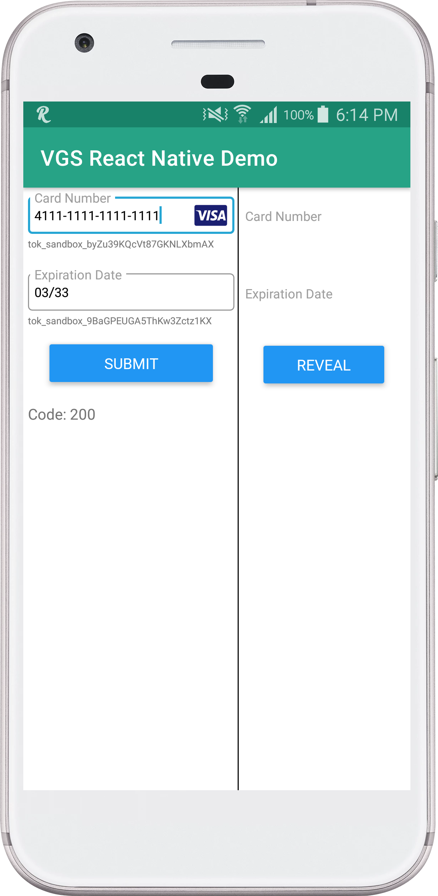

# VGS Collect/Show SDK. React Native Demo.

<p align="center">
    
    
</p>

> **_NOTE:_**  This demo is just an example of how VGS Collect SDK and VGS Show SDK can be integrated into your application.


## How to run it?


### Step 1

Go to your <a href="https://dashboard.verygoodsecurity.com/" target="_blank">VGS organization</a> and establish <a href="https://www.verygoodsecurity.com/docs/getting-started/quick-integration#securing-inbound-connection" target="_blank">Inbound connection</a>. For this demo you can import pre-built route configuration:

<p align="center">

</p>

- Find the **configuration.yaml** file inside the app repository and download it.
- Go to the **Routes** section on the <a href="https://dashboard.verygoodsecurity.com/" target="_blank">Dashboard</a> page and select the **Inbound** tab.
- Press **Manage** button at the right corner and select **Import YAML file**.
- Choose **configuration.yaml** file that you just downloaded and tap on **Save** button to save the route.


### Step 2

`git clone git@github.com:verygoodsecurity/vgs-collect-show-flutter-demo.git`


### Step 3

Development domain: https://facebook.github.io/react-native/docs/getting-started

#### Installing dependencies

**Node & Watchman**:
```
brew install node
brew install watchman
```
**Java Development Kit**:
```
brew tap AdoptOpenJDK/openjdk
brew cask install adoptopenjdk8
```

**Android development environment**:
- Android SDK
- Android SDK Platform
- Performance (Intel ® HAXM) (See here for AMD)
- Android Virtual Device


**Configure the ANDROID_HOME environment variable**:
```
export ANDROID_HOME=$HOME/Library/Android/sdk
export PATH=$PATH:$ANDROID_HOME/emulator
export PATH=$PATH:$ANDROID_HOME/tools
export PATH=$PATH:$ANDROID_HOME/tools/bin
export PATH=$PATH:$ANDROID_HOME/platform-tools
```


### Step 4

Setup `"<VAULT_ID>"`.

**VGS Collect SDK**. Find [VGSCollectModule.java](https://github.com/vgs-samples/vgs-collect-show-android-react-native-demo/blob/master/android/app/src/main/java/com/verygoodsecurity.reactnative/collect/VGSCollectModule.java#L31) and replace `VAULT_ID` constant with your <a href="https://www.verygoodsecurity.com/docs/terminology/nomenclature#vault" target="_blank">vault id</a>.

**VGS Show SDK**. Find [VGSShowModule.java](https://github.com/vgs-samples/vgs-collect-show-android-react-native-demo/blob/master/android/app/src/main/java/com/verygoodsecurity.reactnative/show/VGSShowModule.java#L29) and replace `VAULT_ID` constant with your <a href="https://www.verygoodsecurity.com/docs/terminology/nomenclature#vault" target="_blank">vault id</a>.


### Step 5

Running the project
- Open a Terminal and go to the project directory.
- If this is first start - run ``npm install`` command.
- Run `restart.sh` script to clear cache and build project on emulator.
- Make sure you have ``assets`` folder created here ``/android/app/src/main/assets``


### Step 6

Submit and reveal the form then go to the Logs tab on a Dashboard find a request and secure a payload.
Instruction for this step you can find <a href="https://www.verygoodsecurity.com/docs/getting-started/quick-integration#securing-inbound-connection" target="_blank">here</a>.


